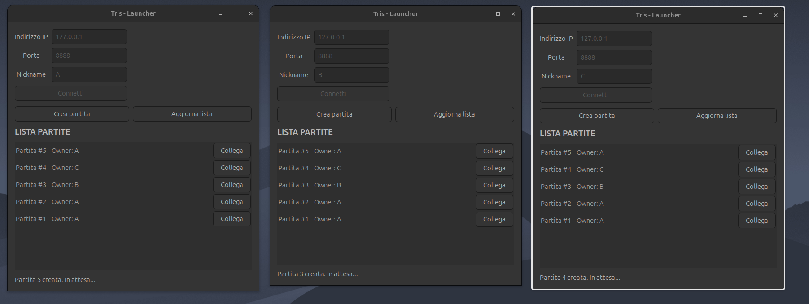
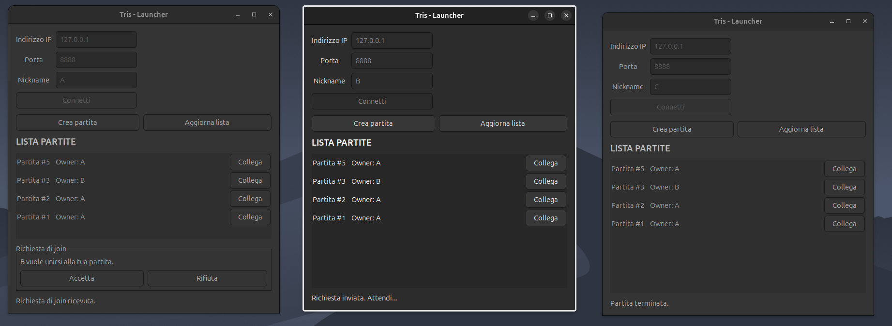
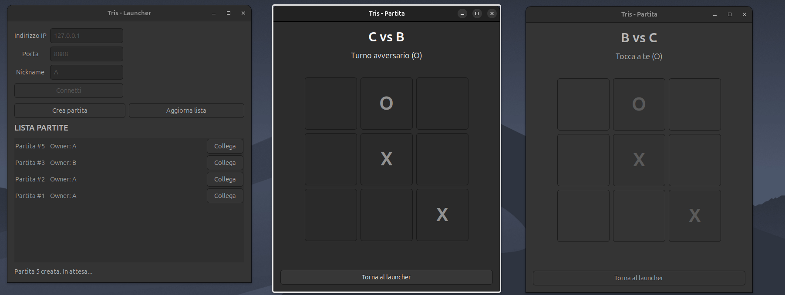
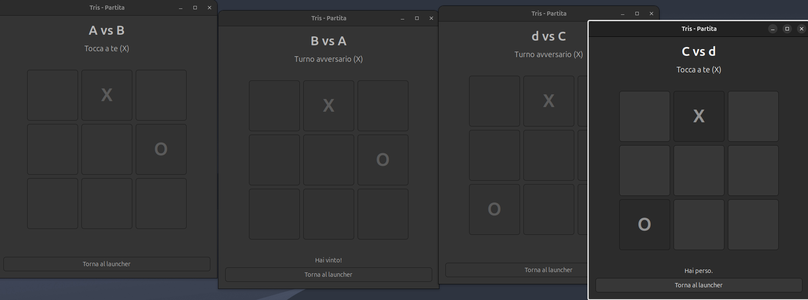

# Multi-Client Tic-Tac-Toe Server

## How It Works

### 1) Multiple players connected, multiple games in waiting state

Several clients can connect at the same time. Each player can create games, and all waiting games are listed in the shared lobby.

### 2) Join request flow with owner moderation

When a player clicks **Connect** on a game, the owner receives a join request and can accept or reject it. Until acceptance, the requester remains in waiting state.

### 3) Match started with synchronized board updates

After the owner accepts, both players enter the match window. Moves are validated by the server and the board is updated for both sides in real time.

### 4) Match outcomes and parallel game sessions

The system supports parallel sessions and correctly reports outcomes (win, loss, draw). Players can return to the launcher and start new games/rematches.

Complete implementation of a multi-client Tic-Tac-Toe server in C, compliant with Project 1 requirements.

## Features

### Implemented Explicit Requirements

- ✅ **Multi-client server**: Handles N simultaneous connections using `fork()` for each client
- ✅ **Multiple games**: A player can create multiple games, but can play only one at a time
- ✅ **Owner moderation**: Game owner can accept/reject join requests
- ✅ **Game states**: `NEW`, `WAITING`, `PLAYING`, `TERMINATED`
- ✅ **Selective broadcasting**:
  - `WAITING` games are visible to all clients
  - Moves are exchanged only between the two players in the match
- ✅ **Unique IDs**: Each game has a unique ID
- ✅ **Outcomes**: Win, loss, draw
- ✅ **Rematch**: Players can play again after a game

### Implemented Implicit Requirements

- ✅ **Disconnection handling**: Automatic cleanup when a client disconnects
- ✅ **Move atomicity**: Server-side validation protected by mutexes
- ✅ **User identification**: Nickname support for each player
- ✅ **Timeout**: 5-minute move timeout (configurable)

## Build

```bash
make
```

Or manually:

```bash
gcc -Wall -Wextra -std=c11 -pthread -g server.c game.c protocol.c -o server -pthread
gcc -Wall -Wextra -std=c11 -g client.c -o client
```

## Usage

### Start Server

```bash
./server [port]
```

Default port: `8888`

Example:

```bash
./server 8888
```

### Start Client

```bash
./client [host] [port]
```

Default host: `127.0.0.1`  
Default port: `8888`

Example:

```bash
./client 127.0.0.1 8888
```

## Client Commands

### Basic Commands

- `SET_NICKNAME <name>`: Set your nickname
- `CREATE_GAME`: Create a new game
- `LIST_GAMES`: List available games
- `JOIN_GAME <id>`: Request to join a game
- `ANSWER_JOIN <yes/no> <game_id> <nickname>`: Reply to a join request (owner only)
- `MOVE <row> <col>`: Play a move (`row` and `col` in range `0..2`)
- `REMATCH <yes/no>`: Decide whether to play again after game over
- `QUIT`: Leave the game
- `HELP`: Show available commands

## Communication Protocol

### Client -> Server

- `CREATE_GAME`: Create a new game
- `LIST_GAMES`: Request the list of games in `WAITING` state
- `JOIN_GAME <game_id>`: Ask to join a game
- `ANSWER_JOIN <yes/no> <game_id> <nickname>`: Owner accepts/rejects a request
- `MOVE <row> <col>`: Submit a move
- `REMATCH <yes/no>`: Post-game decision
- `SET_NICKNAME <name>`: Set nickname
- `QUIT`: Disconnect

### Server -> Client

- `WELCOME <message>`: Connection confirmation
- `GAMES_UPDATE <list>`: Broadcast updated list of available games
- `JOIN_REQ <game_id> <nickname>`: Notify owner about a join request
- `START_GAME <symbol> <game_id>`: Start game (`X` or `O`)
- `BOARD_UPD <grid> <turn>`: Board update after a move
- `GAME_OVER <result>`: Report win/loss/draw
- `TURN <symbol>`: Indicate current turn
- `ERROR <message>`: Error message
- `OK`: Command executed successfully
- `MESSAGE <message>`: Informational message
- `WAITING <message>`: Waiting-state message

## Architecture

### Data Structures

- **Player**: Represents a connected player
  - `socket_fd`: Socket file descriptor
  - `nickname`: Player name
  - `current_game_id`: Current game ID (`-1` if idle)
  - `is_playing`: Whether the player is currently in a match

- **Game**: Represents a game session
  - `game_id`: Unique game ID
  - `owner`: Pointer to owner player
  - `guest`: Pointer to guest player (`NULL` while waiting)
  - `board[3][3]`: Game grid
  - `current_turn`: Current symbol (`'X'` or `'O'`)
  - `state`: Game state
  - `mutex`: Mutex for thread safety

### Thread Safety

Mutexes are used to protect:

- Global games list
- Global players list
- Each game structure

### Connection Handling

The server uses `fork()` to manage each client in a separate process, simplifying concurrency management compared to threads.

## Handled Edge Cases

1. **Join race condition**: Join requests are processed sequentially
2. **Owner disconnection**: The game is deleted if owner disconnects
3. **Guest disconnection**: The game returns to `WAITING` if guest disconnects
4. **Move timeout**: After 5 minutes without moves, game is auto-resolved
5. **Invalid moves**: Full server-side validation

## Testing

To test the server:

1. Start the server: `./server`
2. Open multiple terminals and start clients: `./client`
3. Create a game from one client: `CREATE_GAME`
4. List games from another client: `LIST_GAMES`
5. Join a game: `JOIN_GAME <id>`
6. Owner accepts: `ANSWER_JOIN yes <id> <nickname>`
7. Play using `MOVE <row> <col>`

## Technical Notes

- The server uses `select()` for non-blocking I/O
- Each client is handled in a separate process (`fork()`)
- Mutexes protect shared data structures
- The protocol is text-based for easier debugging
- The board is serialized as a 9-character string in protocol messages

## Possible Improvements

- [ ] Per-game configurable timeout
- [ ] File-based logging
- [ ] User authentication
- [ ] Match statistics
- [ ] More complete rematch owner handover logic
- [ ] Password-protected games
- [ ] In-game chat

## License

Educational project - free to use for learning purposes.

## Docker

To run this project in a container, see `README_DOCKER.md`.
